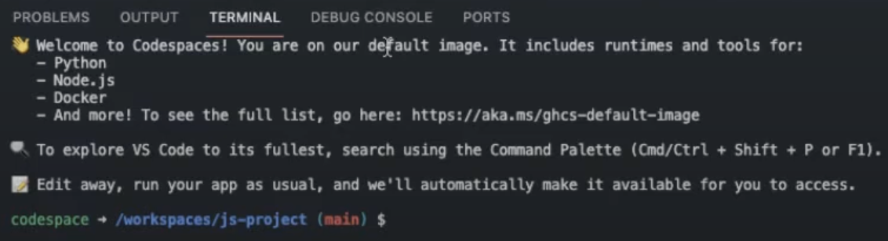

# Challenge project - Build a mini-game console app with GitHub Copilot

Starter and Final code for the Challenge project: "Challenge project - Build a mini-game console app with GitHub Copilot". To check the solution, change the branch to **Solution**.

**What I learned with this challenge:**

https://learn.microsoft.com/en-us/training/modules/challenge-project-create-mini-game-with-copilot/

+ Practice with GitHub: fork, commit, push
+ Set up and use an online codespace
+ Practice to write README.md (adding picture, formatting)

**The encountered difficulties**
+ To add the GitHub Copilot extension. I finally found the solution with the video "Learn Live: Build a mini-game console app with GitHub Copilot" from Microsoft Events, as I was unable to find the ID on the Visual Studio Marketplace
+ When trying to do a "npm" on the terminal as shown in the video about the codespaces, I still have an error message. Moreover, despite it was described in the video, I didn't find all the extensions already installed as described in the video. 
> bash: npm: command not found

Screenshot of the default image of the GitHub codespace 

Video references: 
* "Codespaces documentation" https://docs.github.com/en/codespaces
* "Learn Live: Build a mini-game console app with GitHub Copilot" from Microsoft Events https://www.youtube.com/watch?v=Fi_jl3G7i8Y
